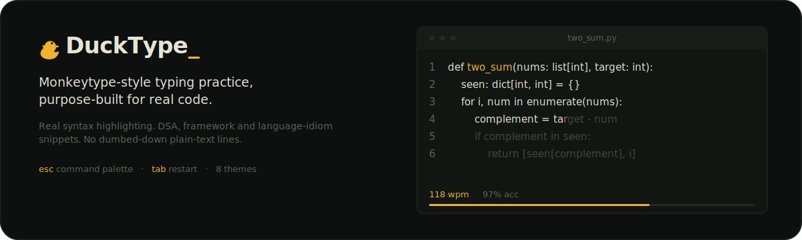

<p align="center">
  
</p>

Monkeytype is the standard for typing practice, but its code support is shallow — one line of plain text, no indentation, no highlighting. DuckType is the IDE-style code practice mode that request has been asking for: real multi-line snippets, real syntax highlighting, real language support.

## What it is

- **Live syntax-highlighted typing test** — character-by-character comparison against a real snippet, tokenized with [Shiki](https://shiki.style), correct/wrong/pending state layered on top of the real token colors
- **WPM, raw WPM, accuracy, consistency, error count** — timer starts on first keystroke, not page load
- **Instant start** — land on the page, start typing immediately; no login wall, no menu, `tab` for a new snippet
- **Command palette** (`ctrl+p` / `esc`) — fuzzy-searchable, switches language, mode, theme, font, test length
- **IDE mode** — full-page takeover with titlebar, gutter, and status bar for the full, untruncated snippet
- **Funboxes** — blind, no-backspace, sudden-death, memory, zen, assist

## Modes

| Mode | What you type |
| --- | --- |
| General | idiomatic snippets in a base language |
| Framework | React, Django, and other framework-scoped idioms |
| DSA | well-known algorithms, problem statement alongside the solution |
| Custom | paste your own code, saved privately to your account |

Python, JavaScript/TypeScript, C++, Java, Go, Rust — curated and hand-picked, not scraped.

## Themes

`mallard` (default, pond-dark / bill yellow) · `serika dark` · `carbon` · `paper` · `dracula` · `gruvbox` · `nord` · `rosé pine` — switchable instantly from the command palette, no reload.

## Run

```bash
npm install
npm run dev
```

Open http://localhost:3000.

## Stack

Next.js App Router + TypeScript · Tailwind CSS · Shiki · cmdk · Supabase (auth/history)

## Accounts

Never required to take a test — only to save history, stats, and custom snippets long-term.

```bash
cp .env.example .env.local
```

```bash
NEXT_PUBLIC_SUPABASE_URL=
NEXT_PUBLIC_SUPABASE_ANON_KEY=
```

Run `supabase/schema.sql` in the Supabase SQL editor. Enable GitHub and Google OAuth providers in Supabase Auth.
